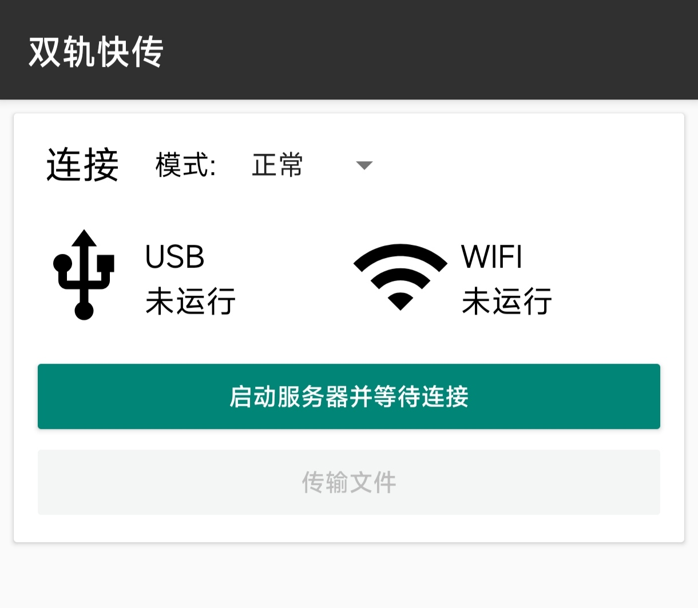
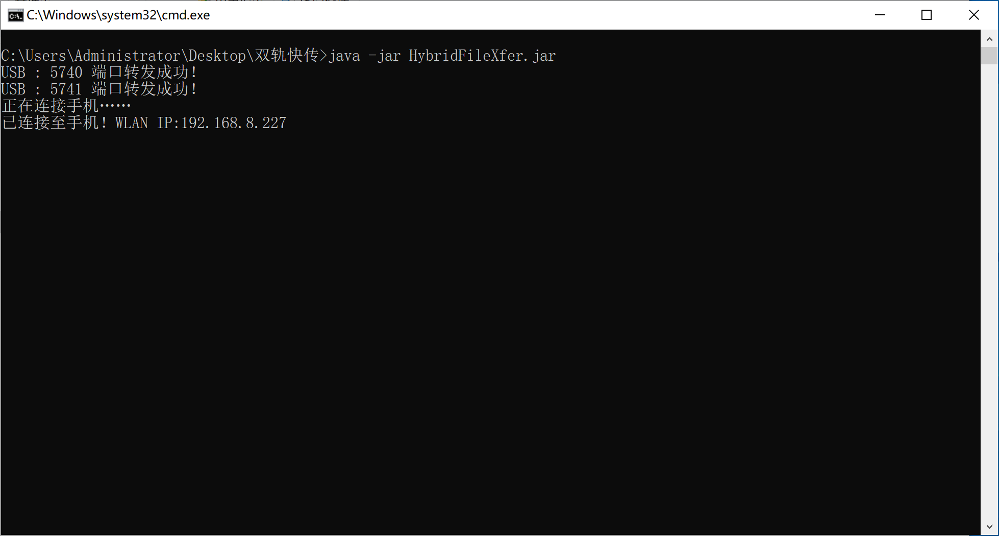
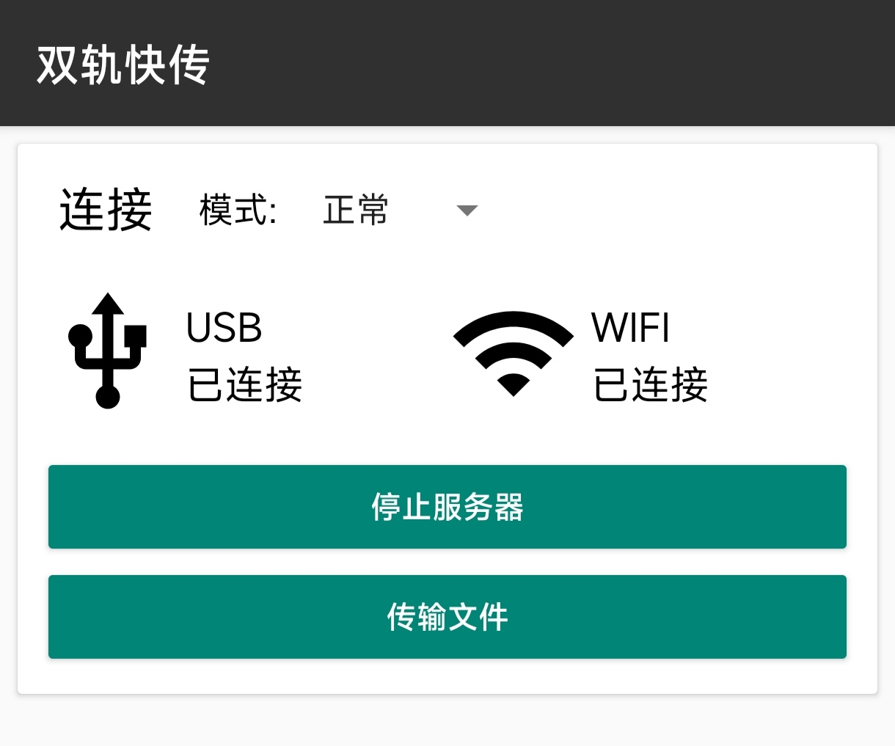
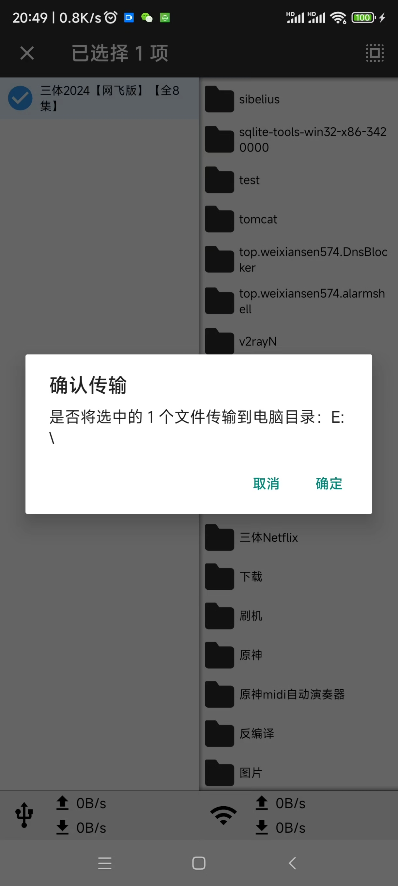
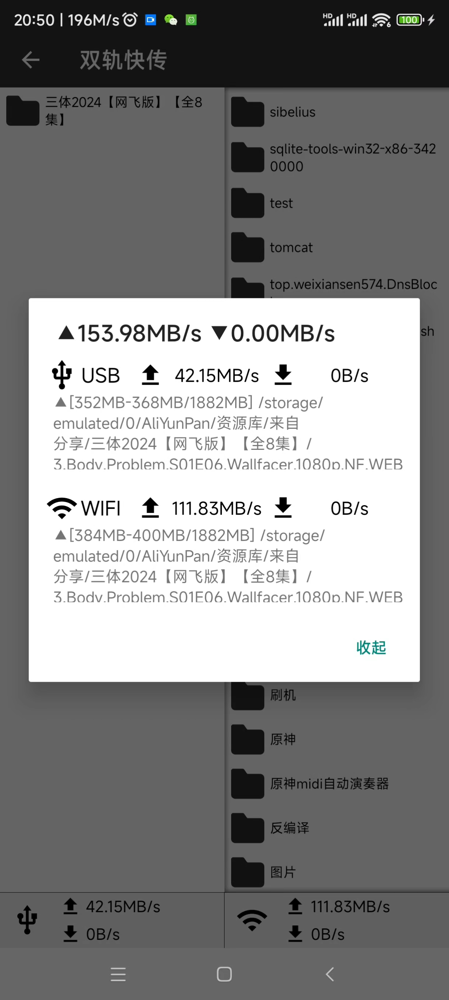
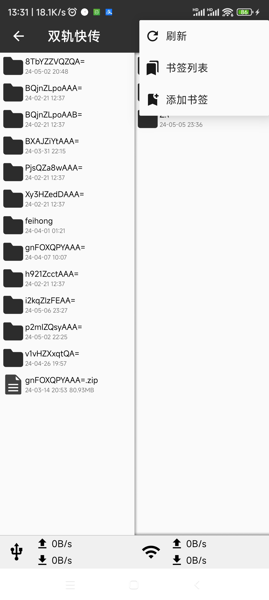
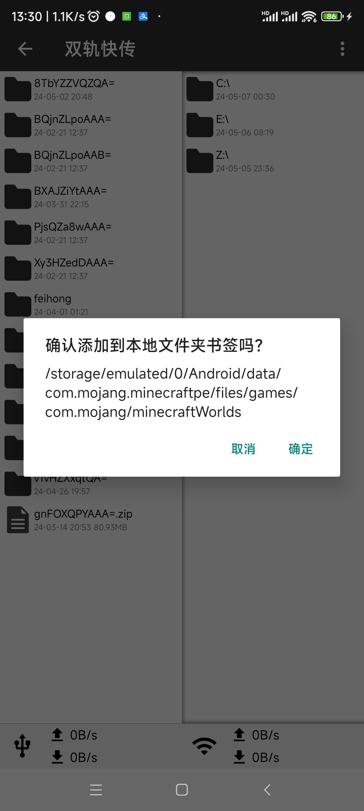
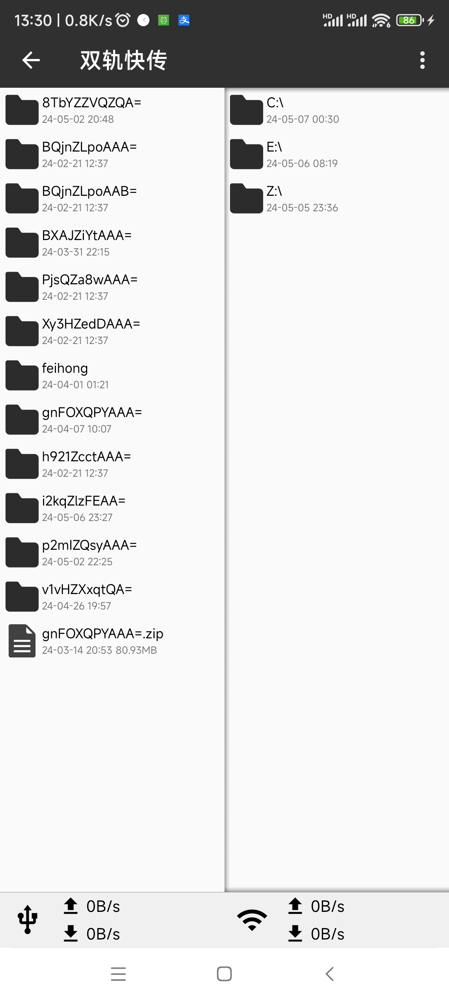

# 双轨快传
双轨快传，一个可以同时使用USB和WIFI传输文件到电脑的软件

USB2.0+WIFI6_1000mbps网口可以跑到150MB/s（40+110MB/s）！

## 速度测试


# 使用

## 模式

支持普通模式和Root模式，Root模式可访问`~/Android/data/`与`/data/data/`目录下的文件。

Root模式需要安装[Sui模块](https://github.com/RikkaApps/Sui/releases)，若你已有Magisk的root，还需要刷入这个模块。

## 连接

先插上数据线并连接WIFI，WIFI需要与电脑处在同一局域网内（推荐电脑使用网线直连路由器）

设置开启USB调试，这是使用USB传输的依赖（原理：`adb forward tcp:<port> tcp:<port>`，把手机的服务端端口转发到电脑上，以此建立TCP连接）

主界面选择好模式后点击按钮`启动服务器并等待连接`，状态显示“等待电脑连接”后，电脑双击运行`启动.bat`。如果提示没有java，则需要[安装java运行环境](https://www.oracle.com/java/technologies/javase/jdk17-archive-downloads.html)，安装过程不过多阐述，与我的世界安装java环境过程一致。程序首先执行adb转发端口（USB通道），若电脑未授权USB调试，请点击手机上的“允许这台电脑进行调试”。端口转发完成后，电脑端自动获取手机的WLAN IP地址，两条线路连接成功后即可进行文件传输。









### 返回上级目录

按手机的返回键

### adb指定设备

v1.1版本新增，用命令行运行jar或者修改启动脚本，程序会在末尾添加adb参数

```shell
java -jar HybridFileXfer.jar <adb args...>
#示例
adb devices
#List of devices attached
#1234abcd	device
#4321dcba	device

java -jar HybridFileXfer.jar -s 1234abcd 
#程序附加后
adb -s 1234abcd forward tcp:5740 tcp:5740
```

### Linux电脑

v1.1新增对Linux的支持，下载对应的电脑客户端即可，解压后执行

```shell
java -jar HybridFileXfer.jar
```

或者双击start.bat

目前仅支持x86 CPU的电脑，虽然Java是夸平台的，但是adb对处理器架构有要求。如果你需要在ARM，RISC-V，龙芯等CPU架构下运行，可以寻找对应处理器架构的adb程序，复制到jar包的同一目录

~~可以试试termux-adb+Java运行环境两台手机对拷🤣~~

## 传输

连接成功后，点击传输文件按钮，即可开始选择文件进行传输。

UI是双排文件管理器（照搬的MT管理器）。左边文件列表是当前手机的文件列表，右边为电脑的文件列表。

点击文件夹进入子目录，按手机的返回键，返回当前焦点所在目录的上一级。

长按文件或文件夹，进入选择模式。选择完后，长按任意一个被选中的条目，点击确认对话框的确定即开始传输，选中的文件或文集夹将传输到另一侧的目录里。左往右是传输到电脑，反之就是传输电脑文件到手机。

例如：/sdcard/ > [/sdcard/test/] ==> E:\\transfer\\ > [E:/transfer/test/]

|  |  |
| ------------------------------------------------------------ | ------------------------------------------------------------ |

传输完毕后，点击右上角“←”退出文件列表，点击停止服务器以正常断开与电脑的连接。

## 关于进度条

计算进度是一件比较耗费时间的事情，尤其是遇到许多小文件的时候，计算会非常耗时。例如截图文件夹，计算所消耗的时间就占了总时间的1/3！参照fastcopy的存在。所以没有实现进度条。

## 书签

v1.2.0新增书签功能。

### 添加书签

点击右上角菜单，添加书签。有两个书签列表，一个是**手机**，一个是**电脑**。若当前焦点是本地文件夹，确认后书签将添加至本地文件夹书签列表，若当前焦点是电脑文件夹，确认后书签将添加至电脑文件夹书签列表。

### 跳转书签

点击右上角菜单，书签列表。点击要跳转的书签即可跳转至目标目录。

| 右上角菜单                                                   | 添加书签                                                     | 书签列表                                                     | 跳转后                                                       |
| ------------------------------------------------------------ | ------------------------------------------------------------ | ------------------------------------------------------------ | ------------------------------------------------------------ |
|  |  |  |  |

*演示中的~/Android/data/……目录需要root访问（安卓11以上）*


# 原理

创建一个文件传输任务队列（BlockedQueue），两个线程同步到这个队列拿取任务，对应一个文件或文件切片。

传输多个小于64MB的文件时，每条线路各自传输不同的文件。

传输一个大于64MB的文件时，文件会被切成一个个16MB的切片对象，线程拿到切片对象后会使用RandomAccessFile，读取切片对象所标记的起始位置和结束位置，发送到电脑后，也使用RandomAccessFile，然后按照标示的起始位置和末尾位置写入文件。

具体请查看源码


# 其他

禁止以任何形式转载到飞机杯社区（酷安），否则后果自负！

