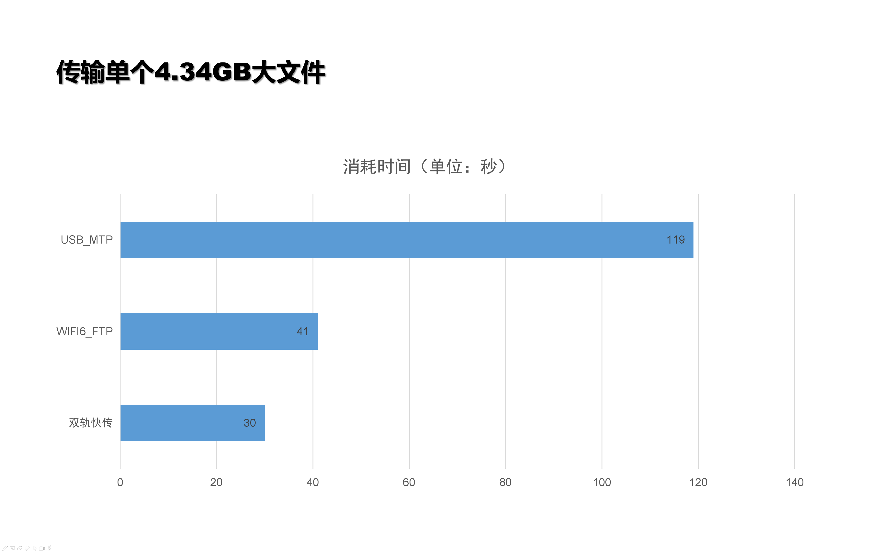
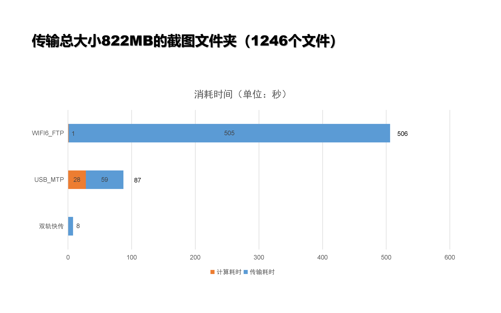
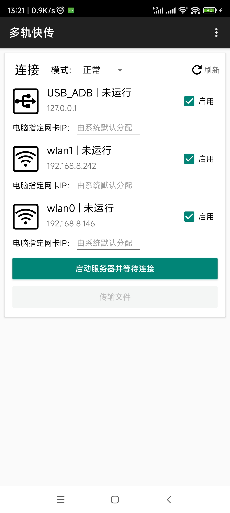
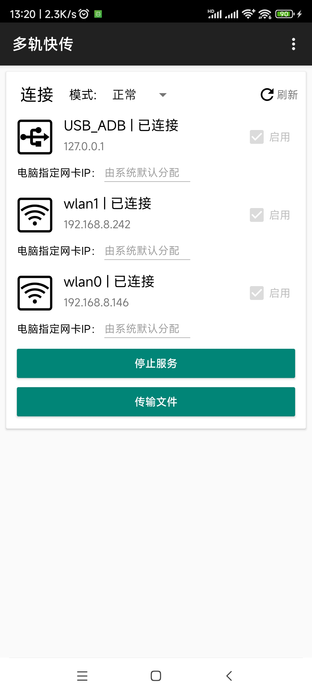
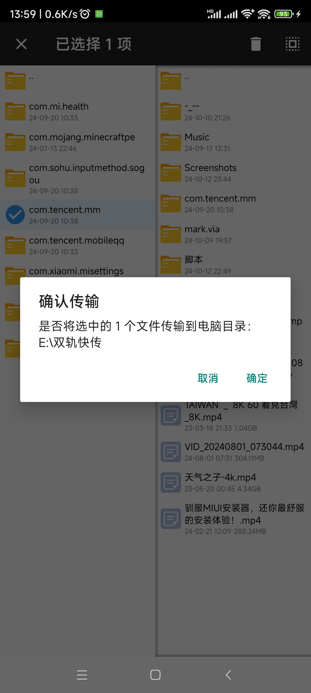
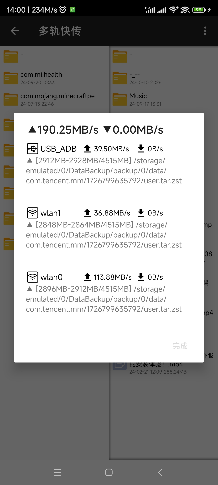
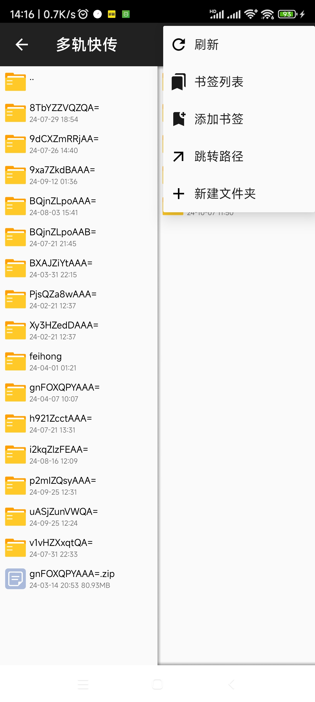
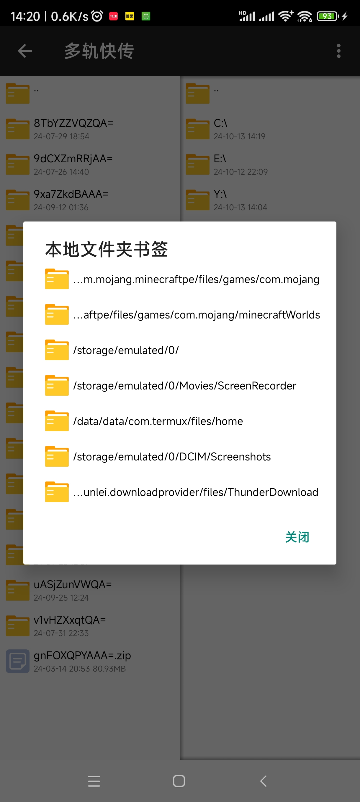

# 多轨快传
多轨快传（原双轨快传），一个可以同时使用USB和WIFI等多张网卡传输文件到电脑的软件

USB2.0+WIFI6（千兆网口）可以跑到150MB/s（40+110MB/s）！

USB2.0+WIFI6_5G:160mhz+WIFI6_2.4G:40mhz 可以跑到200+MB/s！

## 速度测试（USB2.0+WIFI6:GbE）






# 使用

## 模式

支持普通模式和Root模式，Root模式可访问`~/Android/data/`与`/data/data/`等目录下的文件。

Root模式需要安装[Sui模块](https://github.com/RikkaApps/Sui/releases)，若你已有Magisk的root，还需要刷入这个模块。

## 网卡与通道

选择要进行传输的网卡，一个网卡一个通道。

只要能被识别为网卡的，都会显示在网卡列表中，比如这些

- 连接一个WIFI
- 连接双WLAN加速的辅助WIFI
- 打开热点
- USB网络共享
- 蓝牙网络共享（不建议用）
- 物理以太网口
- VPN软件的TUN网卡（请勿选择）

请选择**可以同电脑进行局域网传输**的网卡

USB_ADB的连接比较特殊，它是通过`adb forward tcp:<port> tcp:<port>`转发命令实现的，开启一个在本机的端口使其能使用USB线路进行网络传输

### 电脑端启动

参数说明

```
-c 控制通道连接方式 "adb" 或 网络ip
-s adb连接方式下指定的设备（adb有多设备的情况），你可以用"adb devices"命令查看设备
示例：
-c adb
-c adb -s abcd1234
-c 192.168.1.2
```

完整启动命令示例

```
java -jar HybridFileXfer.jar -c adb
java -jar HybridFileXfer.jar -c adb -s abcd1234
java -jar HybridFileXfer.jar -c 192.168.1.2
```

## 连接

插上数据线并连接WIFI，WIFI**需要与电脑处在同一局域网内**（推荐电脑使用网线直连路由器）

通道分为控制通道与传输通道

`-c` 参数指定的是控制通道的连接方式，为`adb`或IP地址，IP地址可填写任意一个手机的网卡IP。

USB_ADB的连接需要USB调试，请到开发者选项中打开，**如果你因各种原因不能使用ADB，可以改用USB网络共享代替ADB。**

主界面选择好模式后点击按钮`启动服务器并等待连接`，状态显示“等待连接”后，电脑双击运行启动脚本`启动_ADB连接.bat`（或者你根据启动参数自己编写一个）。如果提示没有java，则需要[安装java运行环境](https://www.oracle.com/java/technologies/javase/jdk17-archive-downloads.html)，安装过程不过多阐述，与我的世界安装java环境过程一致。ADB连接方式下，程序首先执行adb转发端口（USB通道），若电脑未授权USB调试，请点击手机上的“允许这台电脑进行调试”。端口转发完成后，启动电脑客户端，客户端先连接控制通道，然后从控制通道获取手机指定的传输通道网卡信息，然后电脑客户端连接到这些传输通道网卡，选择的线路都连接成功后，『传输文件』按钮亮起即可进行文件传输。

|                        选择模式与网卡                        |                           电脑连接                           |
| :----------------------------------------------------------: | :----------------------------------------------------------: |
|  |  |

**电脑输出**

```
adb:5740
USB_ADB : 5740 端口转发成功！
正在连接 网卡名：USB_ADB 远程地址：127.0.0.1 绑定地址：null
正在连接 网卡名：wlan1 远程地址：192.168.8.242 绑定地址：null
正在连接 网卡名：wlan0 远程地址：192.168.8.146 绑定地址：null
传输通道已全部连接完成
```

## 技巧

- 小米手机：WLAN => WLAN助理 => 智能多网加速 => 双WLAN加速，选择第二条不同频段的WIFI，可实现5Ghz+2.4Ghz加速！其他手机自行探索。

- 如果你没有路由器，但电脑有无线网卡，可以手机打开热点给电脑或反过来操作，即可建立电脑与手机之间的无线局域网，进行文件传输

- 如果5Ghz频段WIFI已可以跑满你电脑的千兆网口，你没有2.5G网口，如何通过双WLAN加速来提高传输速度？

  - 如果电脑还有一个无线网卡。电脑打开一个不同频段的热点，然后手机连接电脑的热点作为辅助WLAN。或者手机打开与已连接WIFI不同频段的热点（切勿相同频段，能打开成功但一定会干扰降速！），电脑连接手机开的热点。

  - 如果电脑有两个千兆网卡。方法一是网卡合并，效果最好但是难以操作。方法二：两条网线都插入路由器，此时两张网卡各自一个IP地址。手机开启双WLAN加速，连接两个频段的WIFI。返回软件，此时由于电脑两张网卡都连接着同一上级路由，若系统默认分配，可能双WLAN的流量都走同一张网卡！所以需要在手机上设置『电脑指定网卡IP』使这两条通道各自走独立的电脑网卡。各自填写上对应的电脑网卡IP即可。


### Linux电脑

v1.1新增对Linux的支持，下载对应的电脑客户端即可，解压后执行对应命令，例如

```shell
java -jar HybridFileXfer.jar -c adb
```

目前仅支持x86 CPU的电脑，虽然Java是跨平台的，但是adb对处理器架构有要求。如果你需要在ARM，RISC-V，龙芯等CPU架构下运行，可以寻找对应处理器架构的adb程序，复制到jar包的同一目录。又或者使用USB网络共享。

~~可以试试termux-adb+Java运行环境两台手机对拷🤣~~

## 传输

连接成功后，点击传输文件按钮，即可开始选择文件进行传输。

UI是双排文件管理器（照搬的MT管理器）。左边文件列表是当前手机的文件列表，右边为电脑的文件列表。

点击文件夹进入子目录，按手机的返回键，返回当前焦点所在目录的上一级。

长按文件或文件夹，进入选择模式。选择完后，长按任意一个被选中的条目，点击确认对话框的确定即开始传输，选中的文件或文集夹将传输到另一侧的目录里。左往右是传输到电脑，反之就是传输电脑文件到手机。

例如：/sdcard/ > [/sdcard/test/] ==> E:\\transfer\\ > [E:/transfer/test/]

|                                                              |                                                              |
| ------------------------------------------------------------ | ------------------------------------------------------------ |
|  |  |


传输完毕后，点击右上角“←”退出文件列表，点击停止服务器以正常断开与电脑的连接。

## 关于进度条

计算进度是一件比较耗费时间的事情，尤其是遇到许多小文件的时候，计算会非常耗时。例如截图文件夹，计算所消耗的时间就占了总时间的1/3！参照fastcopy的存在。所以没有实现进度条。

## 书签

v1.2.0新增书签功能。

### 添加书签

点击右上角菜单，添加书签。有两个书签列表，一个是**手机**，一个是**电脑**。若当前焦点是本地文件夹，确认后书签将添加至本地文件夹书签列表，若当前焦点是电脑文件夹，确认后书签将添加至电脑文件夹书签列表。

### 跳转书签

点击右上角菜单，书签列表。点击要跳转的书签即可跳转至目标目录。

| 右上角菜单                                                   | 添加书签                                                     | 书签列表                                                     |
| ------------------------------------------------------------ | ------------------------------------------------------------ | ------------------------------------------------------------ |
|  |  |  |

*演示中的~/Android/data/……目录需要root访问（安卓11以上）*


# 原理

创建一个文件传输任务队列，两个线程同步到这个队列拿取任务，对应一个文件或文件切片。

传输多个小于64MB的文件时，每条线路各自传输不同的文件。

传输一个大于64MB的文件时，文件会被切成一个个16MB的切片对象，线程拿到切片对象后会使用RandomAccessFile，读取切片对象所标记的起始位置和结束位置，发送到电脑后，也使用RandomAccessFile，然后按照标示的起始位置和末尾位置写入文件。

具体请查看源码

# 魔法

禁止以任何形式在飞机杯社区（酷安）分享本软件，否则后果自负！


酷安斐济杯文章来源[https://mp.weixin.qq.com/s/gt8DiwC3kWmyzjLCze1TRg](https://mp.weixin.qq.com/s/gt8DiwC3kWmyzjLCze1TRg)

# 赞助

前赞助计划[2.5G-WIFI6 GL-MT6000 路由器](https://m.tb.cn/h.gcb0Q6flYgnOqrX?tk=ubRnWtrez83)，已通过大家的赞助+自己的费用购买到，谢谢大家的赞助！

喜欢本软件可以赞助支持！

请备注“赞助双轨快传-[你的github ID]”。所有赞助名单都将公布！

若你想匿名赞助，请填写备注`赞助双轨快传`但不备注你的信息，**否则我无法判断收款码收款意图！将不会纳入赞助名单！**

[查看赞助名单](./赞助名单.md)


## 许可证

本项目使用的JDK来源于 **Dragonwell JDK**，该部分代码受到 **GNU General Public License version 2 (GPL-2.0)**，并且附加 **Classpath Exception** 的保护。

**Dragonwell JDK** 的许可证原文请参见 [Dragonwell JDK License](https://github.com/dragonwell-project/dragonwell21/blob/master/LICENSE)。

本项目整体使用 **GNU General Public License version 3 (GPL-3.0)**，许可证文件可以在 [LICENSE](./LICENSE) 文件中找到。

### Dragonwell JDK License

**Dragonwell JDK** 的代码基于 **GPL-2.0** 发布，并附有 **Classpath Exception**。这些条款允许您将该库与其他独立的模块链接，以创建和分发符合其他许可证要求的可执行文件。

特别说明：
- 如果你将本项目进行分发，务必保留 **Dragonwell JDK** 的版权声明和许可证原文。
- 本项目中的其他部分基于 **GPL-3.0**，这意味着任何对本项目的修改和分发必须符合 GPL-3.0 的条款。

## 免责声明

> 我们欢迎来自世界各地的开发者加入我们的项目大家庭。我们尊重每个人的身份认同和个性表达，不论他们如何定义和看待自己。我们的目标是构建一个开放、包容和友善的社区，让所有人都能在这里自由地分享知识、交流想法，并共同为项目的成长贡献力量。
>
> 请注意，GitHub上的头像和个人简介是每位贡献者展示自我的窗口，它们仅仅代表了个人的选择和偏好，并不代表项目的立场或官方观点。我们鼓励大家在社区中保持尊重、理解和包容的态度，避免对他人进行任何形式的歧视或攻击，无论是基于身份认同、个性表达还是其他任何因素。

 由文心一言生成，不喜勿喷